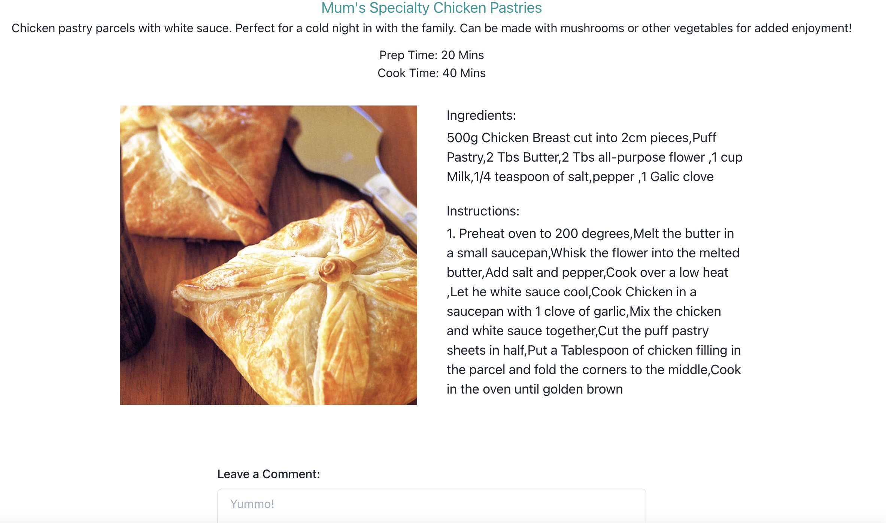
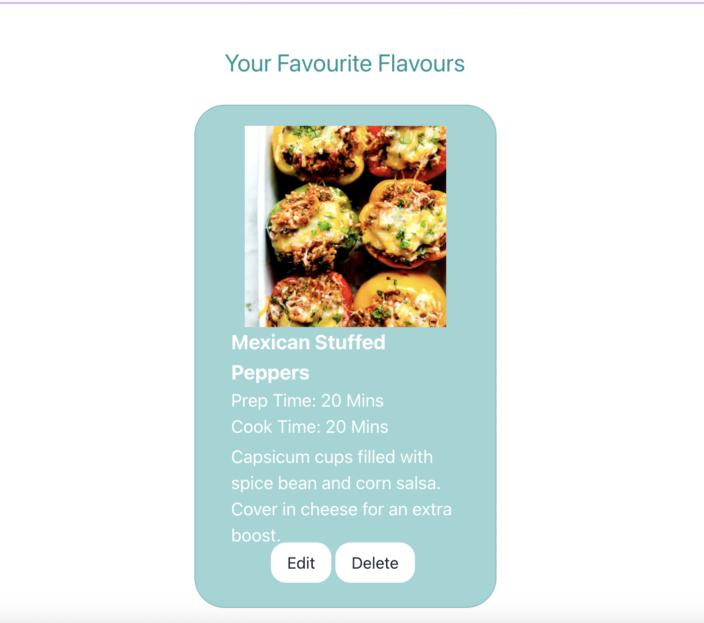
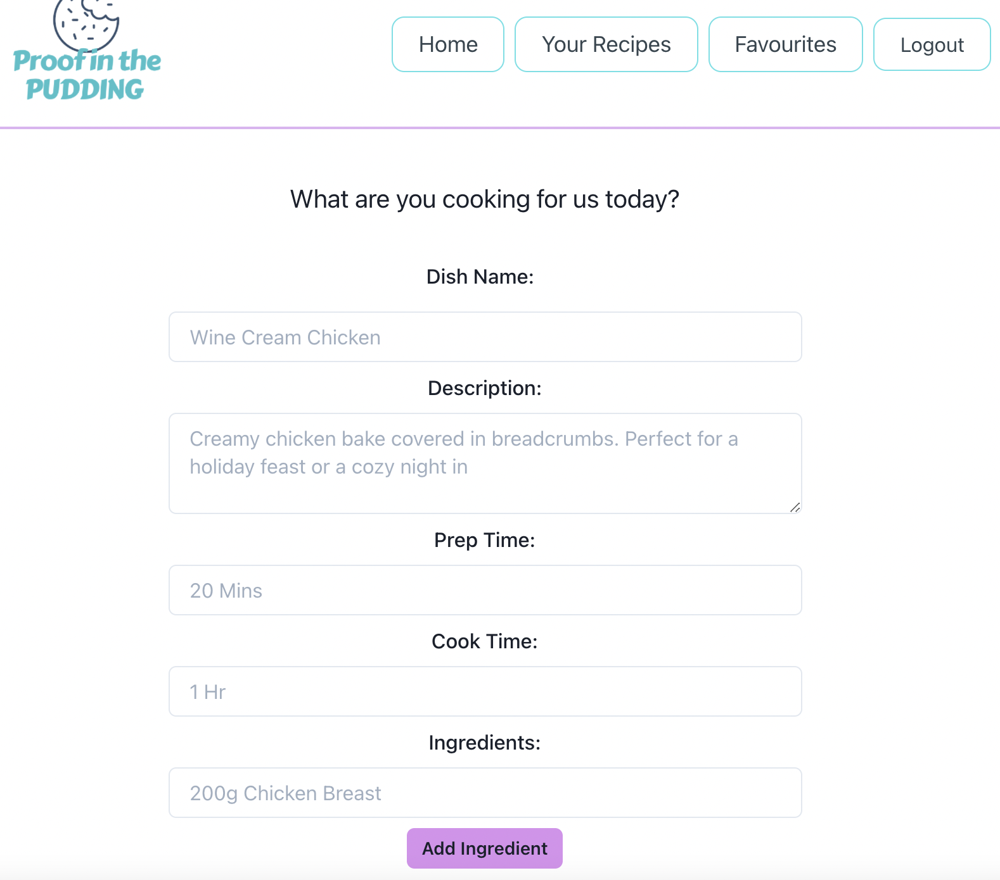

# proof-in-the-pudding-recipe-forum

# Description

This platform allows people to share their favourite recipes! Whether made yourself or passed down through the family, you can now share the love of cooking with the whole community.
I often find the worst part of my day is deciding what to cook for dinner. It so hard to find recipes that the every day cook can make. This tool makes it easy to get new recipe ideas or share your own favourite recipes.
The site allows you to create your own recipies that are then saved to your dahsboard and the home page. You can edit or delete these at any time! You can also view other users full recipies as well as leaving helpful tips and tricks or positive comments on the recipies you enjoyed. You can also add recipies to your favourites and edit them to your own likings. These are private so feel free to experiment and make it your own!

# Table of Contents

- [Useage](#useage)
- [Contributing](#contributing)
- [License](#license)
- [Questions](#questions)

# Useage

The site is deployed at

# Contributing

Created by Madeleine O'Dea

# License

Licensed under MIT. 
For more information, visit this link. 
https://opensource.org/licenses/MIT

# Questions

For more examples of my work, please visit my GitHub at [madsterest](https://github.com/madsterest)
or contact me at
odea.madeleine@gmail.com
